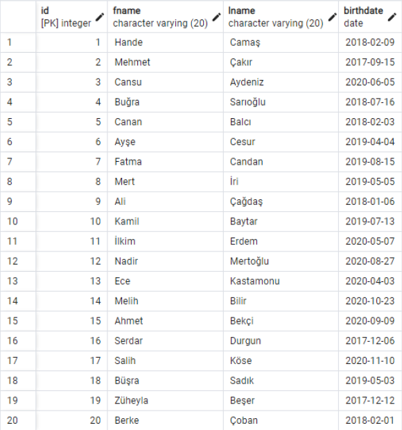
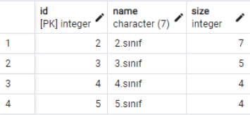
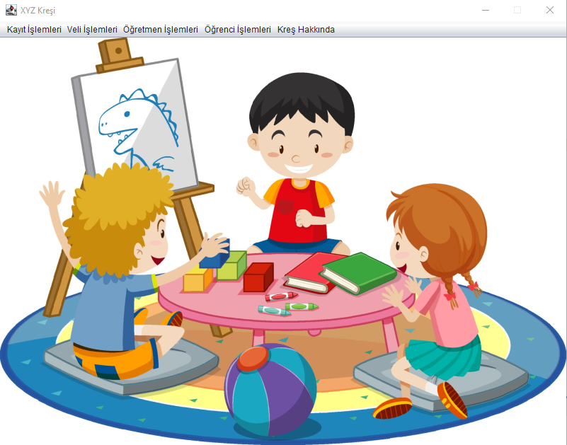
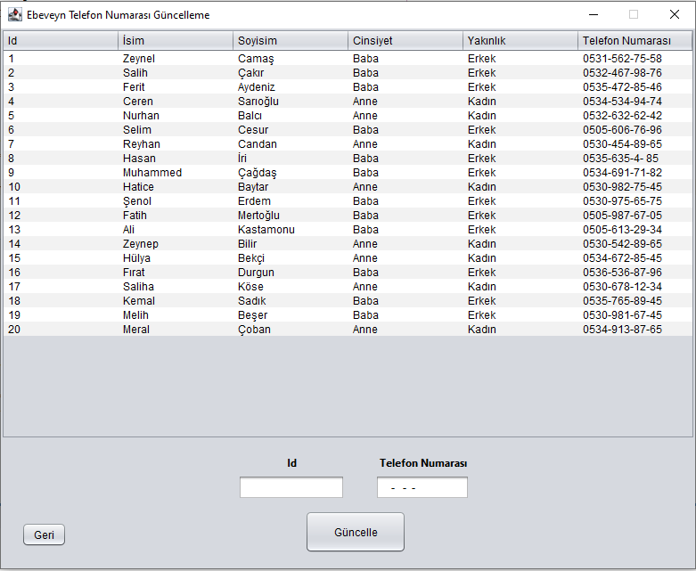
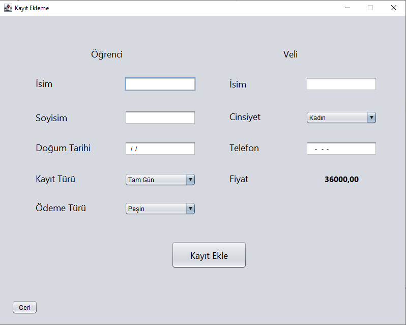

# Son Güncelleme: 11/02/2023
• Bu projede Java programlama dili, SWING kütüphanesi ve PostgreSQL kullanılarak bir Kreş Bilgi Sistemi yapılmıştır.  
• MainScreen.java dosyasında 16.satırdaki password değerini kendi PgAdmin şifrenizle değiştiriniz.  
• PgAdmin uygulamasında 'XYZKresi' adında bir veritabanı oluşturun ve 'Database.sql' dosyasını çalıştırın. Veritabanı oluştuktan sonra programı çalıştırabilirsiniz.  
• Programdan çıkmak için ana ekrana dönüş sağlamalısınız.  
• Kreşimize sadece 2, 3, 4 veya 5 yaşındaki çocuklar kaydedilebilir.  
• Bir öğretmeni silebilmek için o sınıfı yöneten başka bir öğretmen daha olmalıdır.  
• Kreşimizde 'Tam Gün' ve 'Yarım Gün' olmak üzere iki tür kayıt türü bulunmaktadır. Kayıt türüne göre kayıt ücreti değişmektedir.  

## ER Diagram

  

### Örnek Veritabanı Tablo Görüntüleri

Child Tablosu

  

Class Tablosu

  

### Örnek Program Çıktıları

  

  

  

